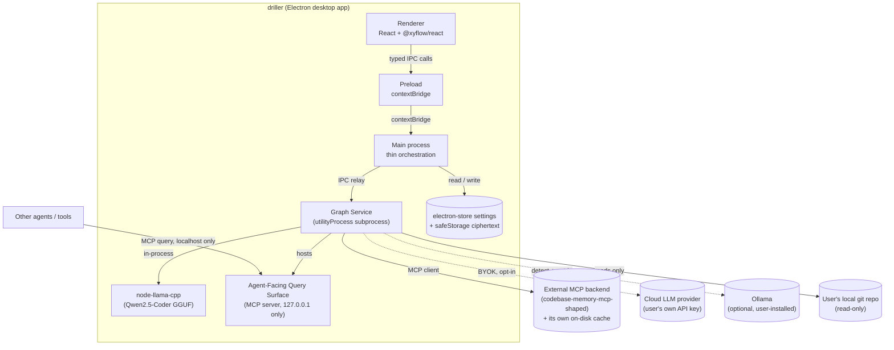

# Architecture: driller

> Living architecture documentation for driller, following the [arc42](https://arc42.org) template. Distilled from the founder's original [Architecture Spine](../../_bmad-output/planning-artifacts/architecture/architecture-driller-2026-09-03/ARCHITECTURE-SPINE.md) (2026-09-04), which remains the historical record of *why* these decisions were made. This file is the current source of truth for architecture — update it directly as decisions change or new ones are made; don't fork a v2 alongside it.
>
> Requirements (FRs/NFRs referenced throughout) are defined in [prd.md](prd.md). See [README.md](README.md) for how this fits with the other docs in this folder.

## 1. Introduction and Goals

driller is a local-first Electron desktop app that gives a software engineer a browsable, AI-summarized, risk-annotated call graph of a codebase — the "Code Map" — as the default entry point for reviewing AI-agent-written code, instead of a diff or file tree. See [prd.md §1](prd.md#1-vision) for the full vision and [prd.md §2](prd.md#2-target-user) for the target user and key journeys.

**Top quality goals**, in priority order:

1. **Trust honesty.** Never let a degraded, incomplete, or stale view of the code present itself as complete or current (drives NFR2, NFR4, and the coverage/staleness mechanisms in §8).
2. **Interaction performance.** Map pan/zoom/selection quality is named as the product's real differentiator, not feature count — see AD-14.
3. **Privacy.** No code content ever leaves the local machine to driller-operated infrastructure, under any configuration — see AD-16.
4. **Security.** Standard Electron hardening plus a locked-down agent-facing surface — see AD-11, AD-10.

**Stakeholders:** the founder (primary user and sole engineering team at v1), the Supervising Engineer persona (see prd.md), and — via the Agent-Facing Query Surface (FR14/15) — other AI agents and tools that consume driller's graph as shared ground truth.

## 2. Constraints

- **Technical:** Electron desktop app only in v1 (no web/server variant); must integrate an existing MCP-based code-graph backend rather than build indexing from scratch (see §5); native modules (`node-llama-cpp`, tree-sitter bindings) must build against Electron's bundled Node ABI.
- **Organizational:** single founder-engineer team; v1 must be dogfoodable on a real ~1,000–1,300-file repo before wider release (NFR1).
- **Product/legal:** every privacy and non-goal constraint in [prd.md §7](prd.md#7-non-goals-explicit) is a hard architectural constraint, not a suggestion — most concretely, AD-16 (no driller-operated server ever sees code content) and AD-17 (read-only filesystem/git access).

## 3. Context and Scope



**Scope of this document:** driller's own code — the Electron main process, renderer, and Graph Service subprocess. It governs neither the underlying MCP-based graph backend (external dependency, consumed not owned — see AD-6) nor the deferred web + companion-daemon variant.

**External systems:**
- **MCP-based graph backend** — the structural indexing/search engine driller builds on rather than reimplementing (codebase-memory-mcp-shaped). Owns its own on-disk cache; driller never writes into it (AD-6).
- **Cloud LLM provider** — user's own bring-your-own-key account (e.g. Anthropic, OpenAI). Only reached if the user configures it (FR6).
- **Ollama** — optional, user-installed local inference alternative, detected but never the default path (AD-18).
- **PR-review bots (CodeRabbit, Qodo)** — invoked via their local CLI mode only, never their hosted API (AD-12).
- **Other agents/tools** — query the Agent-Facing Query Surface over MCP, localhost-only (AD-10).

## 4. Solution Strategy

**Paradigm: Hexagonal (Ports & Adapters), applied at a process boundary**, not just a code-level interface. The Graph Service subprocess *is* the port/adapter around the external MCP backend (AD-1) — a whole OS process, not an injected class. Electron main is a thin orchestration shell with no domain logic, only window lifecycle and IPC routing. The renderer is a pure driven actor that never reaches the port directly, only through main's typed, `contextBridge`-exposed IPC (AD-11).

This is deliberately a single concrete adapter, not a general plugin system — the PRD's own Non-Goal rules out a pluggable-backend abstraction, and AD-6 keeps the boundary a one-way seam (driller never owns or reaches into the backend's storage) rather than a multi-backend framework.

Key strategic choices this drives:
- All indexing/LLM/risk-computation work is isolated in a subprocess so it can never block the UI thread or take the whole app down on crash (AD-1).
- Every Graph Service operation is defined once, transport-agnostically, in `packages/graph-contracts`, then exposed identically to the renderer (via IPC) and to external agents (via MCP) — built once for the human UI, reused as-is for the Agent-Facing Query Surface (AD-13, realizing FR15's parity requirement structurally rather than by convention).
- Rendering at scale is solved once, as a shared mechanism (LOD + virtualization, AD-2), consumed by every mode rather than rebuilt per mode.

## 5. Building Block View

| Layer | Directory | Role |
| --- | --- | --- |
| Driven actor (UI) | `apps/desktop/renderer/` | React Code Map UI; depends only on the preload-exposed IPC API |
| Boundary/bridge | `apps/desktop/preload/` | `contextBridge`-exposed, explicitly-typed IPC surface — the only path from renderer to main |
| Orchestration shell | `apps/desktop/main/` | Window/lifecycle, IPC routing, settings/secrets persistence, Graph Service subprocess spawn/teardown |
| Port/adapter | `services/graph-service/` | Owns the MCP client connection, indexing, summary generation, risk-signal computation, and the Agent-Facing Query Surface (MCP server) |
| Shared contracts | `packages/graph-contracts/` | Transport-agnostic Graph Service operation contracts — shapes + result-state enums (AD-13, AD-19, AD-20) |
| Shared contracts | `packages/ipc-contracts/` | IPC-shaped wrapper re-exporting `graph-contracts` for main↔renderer and main↔Graph Service messages |
| External (not owned) | — (out-of-repo) | The MCP-based graph backend and its own on-disk cache |

```text
driller/
  apps/
    desktop/
      main/            # Electron main: window lifecycle, IPC routing, Graph Service spawn/teardown (AD-1, AD-11)
      preload/          # contextBridge-exposed typed IPC API — renderer's only path out (AD-11)
      renderer/          # React + TypeScript UI: Code Map, PR Review Mode, Health Audit Mode, Settings (AD-2, AD-3)
  services/
    graph-service/        # utilityProcess subprocess: MCP client, indexing, summaries, risk signals, Agent-Facing Query Surface (AD-1, AD-6, AD-8, AD-9, AD-10)
  packages/
    graph-contracts/         # Transport-agnostic Graph Service operation contracts: shapes + result-state enums (AD-13, AD-19, AD-20)
    ipc-contracts/          # IPC-shaped wrapper re-exporting graph-contracts for main<->renderer and main<->Graph Service messages (AD-1)
```

### Capability to Architecture Map

| Capability | Lives in | Governed by |
| --- | --- | --- |
| FR1 Load Local Project | `apps/desktop/main` (recent projects, folder open), `services/graph-service` (indexing) | AD-1, AD-5, AD-6, AD-15 |
| FR2 Coverage Transparency | `services/graph-service` (coverage check) | AD-1, AD-6, AD-13, AD-15 |
| FR3 Map Default Entry / FR4 Node Traversal | `apps/desktop/renderer` | AD-2, AD-3, AD-11, AD-14 |
| FR5 Per-Node Summary / FR6 Backend Config | `services/graph-service` (generation), `apps/desktop/main` (config, secrets) | AD-4, AD-5, AD-8, AD-16, AD-18 |
| FR7 Deterministic Signal Overlay | `services/graph-service` | AD-9 |
| FR8 LLM-Judgment Signal Overlay | `services/graph-service` (reuses AD-8's job pool) | AD-8, `family` discriminant (§8) |
| FR9 Ingested PR-Bot Findings | `services/graph-service` (CLI shell-out + normalization), `apps/desktop/main` (opt-in setting) | AD-5, AD-12 |
| FR10 Path Trace Search | `services/graph-service` (traversal), `apps/desktop/renderer` (route rendering) | AD-1, AD-13 |
| FR11 Git-Scoped Review / FR12 Blast Radius | `services/graph-service` (diff + traversal), `apps/desktop/renderer` (LOD rendering) | AD-1, AD-2, AD-13 |
| FR13 Whole-Repo Audit View | `apps/desktop/renderer` | AD-2, AD-14 |
| FR14/15 Agent Query + Parity | `services/graph-service` (Agent-Facing Query Surface) | AD-10, AD-13 |
| FR16 Staleness Indicator | `services/graph-service` (computation), `apps/desktop/renderer` (display) | AD-7 |
| FR17 Source One-Click-Away | `apps/desktop/renderer`, via `apps/desktop/preload` | AD-11, AD-23, source-location convention (§8) |

*All Code Map interactions (FR3, FR4, FR12, FR13) are additionally governed by AD-14's performance budget.*

## 6. Runtime View

**Opening a project (FR1, FR2 — Story 1.1/1.2):** user selects a folder → main detects a git repo at the folder root or a parent/child folder and confirms → main spawns the Graph Service via `utilityProcess` → Graph Service connects its MCP client and begins structural indexing → progress events are throttled/batched from Graph Service → main → renderer (AD-8) → structural-indexing-complete unblocks map browsing independently of per-Node summary generation, which continues in the background.

**PR Review flow (UJ-1, FR11/FR12):** renderer requests a diff-scoped Node-set for a base ref → Graph Service resolves the ref (`git merge-base` if omitted), computes the diff via local git only, and returns changed Nodes with an explicit result state (`found` / `no-changes` / `not-a-git-repo` / `no-base-ref-resolvable`) → renderer highlights changed Nodes and their Blast Radius (already computed by AD-9) → user expands the Blast Radius by hop depth on demand, runs a Path Trace, and reads ingested findings, all via the same `graph-contracts` operations.

**Agent query (FR14/FR15):** an external agent connects to the Agent-Facing Query Surface (127.0.0.1 only) and calls the same Node lookup / Path Trace / Blast Radius / diff-scoped / coverage-check operations the renderer uses — served by the identical `graph-contracts` implementation, so the response is byte-for-byte consistent with what the human UI would show for the same Node at the same moment.

**Graph Service crash recovery (AD-1, NFR2):** on an unexpected Graph Service exit, main surfaces `backend-degraded` to the renderer immediately and may attempt exactly one automatic restart with backoff. A second consecutive crash within a short window stops auto-restarting and requires explicit user action — never a silent infinite-retry loop, and never a crash that takes down the whole app. On restart, pending summary work is re-derived from which Nodes still lack a summary in the current merged record (AD-8, AD-20) — a stale-but-present summary is never treated as missing and never auto-regenerated, since that would silently spend local CPU or a user's paid cloud-API budget without consent (AD-7).

## 7. Deployment View

Single-machine, single-process-tree deployment: one Electron app packaged and distributed per platform.

- **Packaging:** Electron Forge, with the `auto-unpack-natives` plugin for native modules (`node-llama-cpp`, tree-sitter bindings) — see AD-3, AD-18.
- **Distribution/updates:** releases publish via `@electron-forge/publisher-github` to GitHub Releases; the app auto-updates via `update-electron-app` against `update.electronjs.org` (wraps Squirrel.Mac/Squirrel.Windows). macOS and Windows builds are code-signed. **Linux has no auto-update path under this mechanism** — an accepted v1 limitation (AD-22).
- **Runtime processes:** Electron main (orchestration) + one long-lived Graph Service `utilityProcess` per open project + the renderer's `BrowserWindow` process(es), all on one machine, no server component.

## 8. Crosscutting Concepts

**Data model conventions:**
- **Node identity (AD-19).** A Node ID derives from content-stable coordinates (file path + fully-qualified symbol path), never raw line numbers, and stays stable across re-index.
- **Node record write model (AD-20).** Additive/merge-write per signal family — a structural re-index updates only structural fields and never clears an existing `summary`, `llm-judgment`, or `ingested` field for a Node whose ID is unchanged.
- **Source-location field.** Every Node and every Risk Overlay signal carries `{file, startLine, endLine}`, with `file` as a POSIX-separator, project-root-relative path — normalized by the producer, never at consumption time. This is the concrete data FR17's one-click-to-source opens from.
- **Signal family discriminant.** Risk Overlay signals carry `family: 'deterministic' | 'llm-judgment' | 'ingested'`, plus `severity` and `sourceTool` for `ingested` signals, so the UI signal strip and Agent-Facing responses render/report each family distinctly and identically.
- **Staleness record (AD-7).** `{mtimeMs, size, contentHash}` persisted per file/Node at generation time; each check compares `mtimeMs`/`size` first and only recomputes `contentHash` on a mismatch. Staleness flagging is display-only — it never triggers regeneration itself.

**Naming:** IPC channels are namespaced `<domain>:<action>` (e.g. `graphService:index:progress`, `graphService:summary:progress`). Code identifiers render verbatim from source, never paraphrased.

**Explicit result states, everywhere.** Every Graph Service operation (Node lookup, Path Trace, Blast Radius, diff-scoped Node-set, coverage-check) returns an explicit enumerated result-state field — `null`/`undefined`/empty-array must never stand in implicitly for "nothing here" (AD-13). This is what lets `backend-degraded`, `no-path-found`, `not-a-git-repo`, etc. be rendered honestly instead of as ambiguous empty states, on both the human UI and the agent-facing surface (NFR4).

**Security baseline (AD-11).** Every `BrowserWindow` sets `contextIsolation: true` and `nodeIntegration: false`, no exceptions, with the sandbox enabled wherever compatible with required native functionality. Renderer code reaches main/Graph Service exclusively through a typed `contextBridge` preload API.

**External editor hand-off (AD-23).** `[Added 2026-09-06]` A Node's source-location data can additionally launch the Supervising Engineer's own editor at the exact line, alongside FR17's existing in-app view. Invoked from main only via a new typed IPC channel — renderer never calls `shell.openExternal` directly, the same AD-11 boundary applied to a new case. Main resolves the stored POSIX-relative, project-root-relative path to an absolute, OS-native path and validates/escapes it before it reaches a URI or subprocess argument. The editor preference is a required, always-populated Settings field defaulting to `system-default`; only a named editor (`vscode`, `jetbrains`) deep-links to the exact line via its own registered URI scheme, since a generic OS file-open cannot. An unresolvable handler surfaces as an explicit failure state, never a silent no-op.

**Agent-Facing Query Surface hardening (AD-10).** Beyond binding to `127.0.0.1` and validating `Origin`, the server also validates the `Host` header on every request as an independent second layer — Origin-only validation alone is vulnerable to DNS-rebinding (the CVE-2025-49596 threat class), so the two checks are defense-in-depth, not redundant.

**Secrets and settings (AD-4, AD-5).** Cloud LLM API keys are stored only as `safeStorage` ciphertext, never raw; on Linux, a `basic_text` storage backend triggers an explicit warning before storing. Structured settings (backend choice, per-project PR-bot opt-in, recent projects) persist via `electron-store` under `userData`.

**Privacy invariants (AD-16, AD-21).** No code content is transmitted to any driller-operated server under any LLM backend configuration. No crash-reporting or telemetry ships in v1; diagnostic logging is local-only, under `userData`, never transmitted. Any future addition here must be evaluated against this invariant and stay visibly separate from it — it does not get grandfathered in by omission. This invariant covers driller-operated infrastructure only: it explicitly does not and cannot cover a third-party PR-bot CLI's own network behavior (AD-12) — UI copy must not conflate the two guarantees.

**Read-only filesystem/git access (AD-12, AD-17).** driller's own code treats the user's project filesystem and git repo as read-only, except for driller's own cache/settings/index storage (which lives entirely outside the project directory, AD-6). This extends to third-party PR-bot CLI shell-outs (AD-12): non-mutating modes only, never a flag that grants write access. Any user-controlled value passed to such a subprocess (branch name, project path) additionally uses safe array-argument APIs, never shell-string interpolation — a distinct threat from the non-mutating-flags rule: that prevents an unwanted write, this prevents arbitrary command execution.

**Rendering at scale (AD-2).** The Code Map implements zoom/proximity-threshold level-of-detail rendering — the full Node set never renders as live rich DOM simultaneously. The LOD/virtualization mechanism lives in one shared module (`apps/desktop/renderer/map/lod/`) reused unmodified by both Health Audit Mode and PR Review Mode; each mode supplies only parameters and visual overlays. A cluster/aggregate representation is renderer-local and never gets an ID that flows into a Graph Service call. Map navigation history is renderer-local ephemeral UI state, never persisted or routed through IPC.

**Summary generation orchestration (AD-8).** Concurrency bounded via `p-queue` in-process, no external broker. Retry relies first on each provider SDK's own retry/backoff, with `p-retry` layered only as an outer per-job retry. Job-queue state is never persisted to disk — on restart, pending work is re-derived from which Nodes still lack a summary. Progress events are throttled/batched, never one IPC message per item. Structural-indexing-complete and summary-generation progress are reported as two distinct signals, never conflated into one loading state.

**Deterministic signal computation (AD-9).** Complexity is computed in-house by walking the tree-sitter AST driller already builds, counting decision-point node kinds per language grammar — no external complexity library. Coverage gaps ingest through a single LCOV-based path regardless of source language. Hotspots derive from `git log --numstat` joined against the file→Node map.

## 9. Architecture Decisions

Full rationale, "prevents" framing, and binding scope for each decision lives in the [original Architecture Spine](../../_bmad-output/planning-artifacts/architecture/architecture-driller-2026-09-03/ARCHITECTURE-SPINE.md) — reproduced here as a condensed index so this document stays the single place to look up *what's decided*, while that file remains the record of *why*. Update both only if a decision materially changes; otherwise treat the spine as frozen history and this table as current.

| AD | Decision |
| --- | --- |
| AD-1 | Main is thin orchestration; all Graph Service work runs in a separate `utilityProcess`; renderer never connects to Graph Service directly. |
| AD-2 | Code Map uses LOD + virtualization; one shared mechanism for Health Audit and PR Review modes. |
| AD-3 | Renderer: React + TypeScript + `@xyflow/react` + shadcn/ui. Graph Service: Node.js/TypeScript on split `@modelcontextprotocol/server`/`client` v2 (beta, accepted risk). Packaging: Electron Forge with `auto-unpack-natives`. |
| AD-4 | Cloud API keys stored only as `safeStorage` ciphertext; explicit warning on Linux `basic_text` backend; `keytar` prohibited. |
| AD-5 | Structured settings persist via `electron-store` under `userData`. |
| AD-6 | driller never writes into or relocates the external MCP backend's own cache; driller's settings store only a project name + path reference. |
| AD-7 | Staleness via hybrid mtime+size pre-check, falling back to content-hash only on mismatch; display-only, never auto-regenerates. |
| AD-8 | Summary generation via in-process `p-queue`, SDK-first retry/backoff, no persisted job-queue state, throttled/batched progress events. |
| AD-9 | Complexity computed in-house from the existing tree-sitter AST; coverage via LCOV; hotspots via `git log --numstat`. |
| AD-10 | Agent-Facing Query Surface binds to `127.0.0.1` only, validates `Origin` and `Host` on every request (§8), versioned semver-style. |
| AD-11 | Every `BrowserWindow`: `contextIsolation: true`, `nodeIntegration: false`, sandbox enabled where compatible; renderer reaches main only via typed `contextBridge`. |
| AD-12 | PR-bot findings sourced via each bot's local CLI mode only (safe array-argument invocation, §8), normalized to a canonical `severity`/`sourceTool`; per-bot privacy disclosure required before opt-in. |
| AD-13 | All five Graph Service query operations defined once in `packages/graph-contracts`, transport-agnostic, exposed identically via IPC and MCP; every operation returns an explicit enumerated result state. |
| AD-14 | Code Map interactions target 60fps, floor ~30fps sustained, ~150ms selection-to-detail-open. |
| AD-15 | Structural indexing: ~3min initial / ~5s incremental at the 1,000–1,300-file scale target; provisional pending profiling. |
| AD-16 | No code content transmitted to any driller-operated server, under any configuration; covers driller-operated infrastructure only, not third-party CLI network behavior. |
| AD-17 | driller's own code treats the project filesystem/git repo as read-only; third-party CLI shell-outs run non-mutating only. |
| AD-18 | Local LLM inference via `node-llama-cpp` running a Qwen2.5-Coder-Instruct GGUF (1.5B primary / 0.5B fallback), downloaded from Hugging Face with SHA-256 verification; Ollama detection is a secondary opt-in path. |
| AD-19 | Node ID derives from content-stable coordinates (file path + symbol path), never raw line numbers. |
| AD-20 | Node record is additive/merge-write per signal family; structural re-index never clears summary/LLM-judgment/ingested fields. |
| AD-21 | No crash reporting or telemetry in v1; diagnostic logging is local-only. |
| AD-22 | Releases via `@electron-forge/publisher-github` + `update-electron-app`; macOS/Windows code-signed; no Linux auto-update path. |
| AD-23 | `[Added 2026-09-06]` External editor hand-off (FR17/Story 1.10): invoked from main only via a new IPC channel, resolved/escaped path, editor preference defaults to `system-default` (no line-jump), named editors (`vscode`/`jetbrains`) deep-link to the exact line. |

### Stack

| Component | Choice |
| --- | --- |
| Electron | v43 |
| Renderer | React + TypeScript, `@xyflow/react` v12.11.6, shadcn/ui |
| Graph Service | Node.js/TypeScript, `@modelcontextprotocol/server`/`client` v2 (beta) |
| Packaging | Electron Forge (`auto-unpack-natives`), `@electron-forge/publisher-github`, `update-electron-app` |
| Settings/secrets | `electron-store`, Electron `safeStorage` |
| Job orchestration | `p-queue` v9.x, `p-retry` v8.0.1 |
| Local LLM | `node-llama-cpp` v3.20.0, Qwen2.5-Coder-Instruct GGUF (1.5B / 0.5B) |
| Optional local LLM | `ollama-js` (opt-in, non-default) |

## 10. Quality Requirements

See [prd.md §5](prd.md#5-non-functional-requirements) for the source NFRs. Concrete, enforceable budgets:

| Budget | Target | Owning AD |
| --- | --- | --- |
| Code Map pan/zoom/selection | 60fps target, ~30fps sustained floor | AD-14 |
| Node-selection-to-detail-open | ~150ms | AD-14 |
| Initial full index | <~3 minutes at 1,000–1,300 files / ~250k–320k LOC | AD-15 |
| Incremental re-index | <~5 seconds | AD-15 |
| Indexing progress visible | within ~5 seconds of folder selection | AD-15, FR1 |

AD-15's figures are provisional (validated against comparable systems, not driller's own implementation) and must be re-validated by profiling once the indexing pipeline exists.

## 11. Risks and Technical Debt

- **Inherited backend risk (AD-6).** driller's coverage is only as complete as the underlying MCP-based backend's own language/framework support and release cadence — a risk this architecture fixes the *ownership boundary* for, not the underlying risk itself.
- **Beta SDK dependency (AD-3).** `@modelcontextprotocol/server`/`client` v2 is beta per its own docs; a pre-stable breaking change may force a Graph Service update independent of driller feature work.
- **Unresolved keyboard-navigation design.** Keyboard-navigable map traversal is a stated NFR5 floor, but how a keyboard user expands into or selects within an LOD cluster (AD-2) is a real, unsolved interaction-design question, not yet a settled floor.
- **Deferred visual synthesis.** DESIGN.md's palette and non-code typography are explicitly deferred to a founder-led pass; do not invent these values ad hoc while building.
- **Unvalidated Qodo CLI integration (AD-12).** The exact `local` git-provider invocation for Qodo Merge/PR-Agent was not independently corroborable against official docs during architecture review — verify directly before implementing that adapter.
- **Linux has no auto-update path (AD-22)** — accepted v1 limitation; a distro-package-manager channel is a real future option, not designed here.
- **Deliberately excluded, not merely deferred** (see also [prd.md §8](prd.md#8-mvp-scope)):
  - *Cross-service API tracing* (connecting a frontend call to a separate backend service's route handler) — a semantic contract-matching problem, not graph traversal; if built, belongs under the LLM-Judgment signal (FR8) as a clearly-labeled inference, never a deterministic one.
  - *Architecture-recommendation / refactor preview* — a code-generation/transformation capability, in direct tension with driller's comprehension-only Non-Goal. Founder's direction: this belongs in a distinct future sibling product ("driller architect") within a broader driller ecosystem, not in driller itself.

## 12. Glossary

See [prd.md §3](prd.md#3-glossary) — maintained once, there, to avoid drift between the product and architecture vocabularies.
