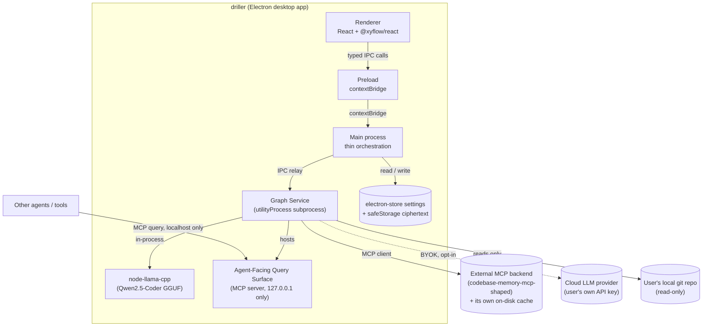

# Architecture: driller

> Living architecture documentation for driller, following the [arc42](https://arc42.org) template. Distilled from the founder's original [Architecture Spine](../../_bmad-output/planning-artifacts/architecture/architecture-driller-2026-09-03/ARCHITECTURE-SPINE.md) (2026-09-04), which remains the historical record of *why* these decisions were made. This file is the current source of truth for architecture — update it directly as decisions change or new ones are made; don't fork a v2 alongside it.
>
> Requirements (FRs/NFRs referenced throughout) are defined in [prd.md](prd.md). See [README.md](README.md) for how this fits with the other docs in this folder.

## 1. Introduction and Goals

driller is a local-first Electron desktop app that gives a software engineer a browsable, AI-summarized, risk-annotated call graph of a codebase — the "Code Map" — as the default entry point for reviewing AI-agent-written code, instead of a diff or file tree. See [prd.md §1](prd.md#1-vision) for the full vision and [prd.md §2](prd.md#2-target-user) for the target user and key journeys.

**Top quality goals**, in priority order:

1. **Trust honesty.** Never let a degraded, incomplete, or stale view of the code present itself as complete or current (drives NFR2, NFR4, and the coverage/staleness mechanisms in §8).
2. **Interaction performance.** Map pan/zoom/selection quality is named as the product's real differentiator, not feature count — see AD-14.
3. **Privacy.** No code content ever leaves the local machine to driller-operated infrastructure, under any configuration — see AD-16.
4. **Security.** Standard Electron hardening plus a locked-down agent-facing surface — see AD-11, AD-10.

**Stakeholders:** the founder (primary user and sole engineering team at v1), the Supervising Engineer persona (see prd.md), and — via the Agent-Facing Query Surface (FR14/15) — other AI agents and tools that consume driller's graph as shared ground truth.

## 2. Constraints

- **Technical:** Electron desktop app only in v1 (no web/server variant); must integrate an existing MCP-based code-graph backend rather than build indexing from scratch (see §5); the native module (`node-llama-cpp`) must build against Electron's bundled Node ABI. *[Corrected 2026-09-23, architect-verified — see AD-9's own correction note in §8/§9]:* driller has no tree-sitter dependency of its own (`node-llama-cpp` is the only native module in any `package.json`); complexity/cognitive-complexity/hotspot analysis happens inside the external MCP backend, not in driller's own build.
- **Organizational:** single founder-engineer team; v1 must be dogfoodable on a real ~1,000–1,300-file repo before wider release (NFR1).
- **Product/legal:** every privacy and non-goal constraint in [prd.md §7](prd.md#7-non-goals-explicit) is a hard architectural constraint, not a suggestion — most concretely, AD-16 (no driller-operated server ever sees code content) and AD-17 (read-only filesystem/git access).

## 3. Context and Scope



**Scope of this document:** driller's own code — the Electron main process, renderer, and Graph Service subprocess. It governs neither the underlying MCP-based graph backend (external dependency, consumed not owned — see AD-6) nor the deferred web + companion-daemon variant.

**External systems:**
- **MCP-based graph backend** — the structural indexing/search engine driller builds on rather than reimplementing (codebase-memory-mcp-shaped). Owns its own on-disk cache; driller never writes into it (AD-6).
- **Cloud LLM provider** — user's own bring-your-own-key account (e.g. Anthropic, OpenAI). Only reached if the user configures it (FR6).
- *[Corrected 2026-09-26, P3-1]* **Ollama is not an external system today.** AD-18 plans Ollama detection as a secondary opt-in path, but none is built: no `ollama` package in any `package.json` and no Ollama code in `apps/`, `services/` or `packages/`. Local inference is `node-llama-cpp` only. No backlog item owns building it yet.
- **PR-review bots (CodeRabbit, Qodo)** — invoked via their local CLI mode only, never their hosted API (AD-12).
- **Other agents/tools** — query the Agent-Facing Query Surface over MCP, localhost-only (AD-10).

## 4. Solution Strategy

**Paradigm: Hexagonal (Ports & Adapters), applied at a process boundary**, not just a code-level interface. The Graph Service subprocess *is* the port/adapter around the external MCP backend (AD-1) — a whole OS process, not an injected class. Electron main is a thin orchestration shell with no domain logic, only window lifecycle and IPC routing. The renderer is a pure driven actor that never reaches the port directly, only through main's typed, `contextBridge`-exposed IPC (AD-11).

This is deliberately a single concrete adapter, not a general plugin system — the PRD's own Non-Goal rules out a pluggable-backend abstraction, and AD-6 keeps the boundary a one-way seam (driller never owns or reaches into the backend's storage) rather than a multi-backend framework.

Key strategic choices this drives:
- All indexing/LLM/risk-computation work is isolated in a subprocess so it can never block the UI thread or take the whole app down on crash (AD-1).
- Every Graph Service operation is computed once, in the Graph Service, and reused by both the renderer (via IPC) and external agents (via MCP) — built once for the human UI, reused as-is for the Agent-Facing Query Surface (AD-13, FR15). *[Corrected 2026-09-26, P3-1]* The parity is structural for three of the five operations only — see §6 "Agent query" for which, and P4-6 for where the operation *shapes* actually live (not all in `packages/graph-contracts`).
- Rendering at scale is solved once, as a shared mechanism (LOD + virtualization, AD-2), consumed by every mode rather than rebuilt per mode.

## 5. Building Block View

| Layer | Directory | Role |
| --- | --- | --- |
| Driven actor (UI) | `apps/desktop/renderer/` | React Code Map UI; depends only on the preload-exposed IPC API |
| Boundary/bridge | `apps/desktop/preload/` | `contextBridge`-exposed, explicitly-typed IPC surface — the only path from renderer to main |
| Orchestration shell | `apps/desktop/main/` | Window/lifecycle, IPC routing, settings/secrets persistence, Graph Service subprocess spawn/teardown |
| Port/adapter | `services/graph-service/` | Owns the MCP client connection, indexing, summary generation, risk-signal computation, and the Agent-Facing Query Surface (MCP server) |
| Shared contracts | `packages/graph-contracts/` | Transport-agnostic Graph Service operation contracts — shapes + result-state enums (AD-13, AD-19, AD-20) |
| Shared contracts | `packages/ipc-contracts/` | IPC-shaped wrapper re-exporting `graph-contracts` for main↔renderer and main↔Graph Service messages. *[Noted 2026-09-26, P4-6]* In practice it is the de facto contract home, not a thin wrapper. It re-exports only `PathTraceResult` and `BLAST_RADIUS_DEFAULT_HOPS` from `graph-contracts`, and itself defines `DiffScopeResult`, `BlastRadiusExpansionResult` and `IndexCoverageSummary`. Two operation shapes live in the Graph Service instead: `NodeLookupResult` in `services/graph-service/mcp-server.ts` and `CoverageSummaryResult` in `services/graph-service/index.ts`. |
| Repo tooling (not shipped) | `scripts/` | Node-run tooling that is never packaged into the app: `npm test`'s preflight/runner and the esbuild TypeScript loader that lets `node --test` import `.ts`/`.tsx` sources |
| External (not owned) | — (out-of-repo) | The MCP-based graph backend and its own on-disk cache |

```text
driller/
  apps/
    desktop/
      main/            # Electron main: window lifecycle, IPC routing, Graph Service spawn/teardown (AD-1, AD-11)
      preload/          # contextBridge-exposed typed IPC API — renderer's only path out (AD-11)
      renderer/          # React + TypeScript UI: Code Map, PR Review Mode, Health Audit Mode, Settings (AD-2, AD-3)
  services/
    graph-service/        # utilityProcess subprocess: MCP client, indexing, summaries, risk signals, Agent-Facing Query Surface (AD-1, AD-6, AD-8, AD-9, AD-10)
  packages/
    graph-contracts/         # Transport-agnostic Graph Service operation contracts: shapes + result-state enums (AD-13, AD-19, AD-20)
    ipc-contracts/          # IPC-shaped wrapper re-exporting graph-contracts for main<->renderer and main<->Graph Service messages (AD-1) — [Noted 2026-09-26, P4-6] in fact the de facto contract home; see the table above
  scripts/                 # Repo tooling Node itself runs, never shipped: the `npm test` preflight/runner and its TypeScript loader
```

### Capability to Architecture Map

| Capability | Lives in | Governed by |
| --- | --- | --- |
| FR1 Load Local Project | `apps/desktop/main` (recent projects, folder open), `services/graph-service` (indexing) | AD-1, AD-5, AD-6, AD-15 |
| FR2 Coverage Transparency | `services/graph-service` (coverage check) | AD-1, AD-6, AD-13, AD-15 |
| FR3 Map Default Entry / FR4 Node Traversal | `apps/desktop/renderer` | AD-2, AD-3, AD-11, AD-14 |
| FR5 Per-Node Summary / FR6 Backend Config | `services/graph-service` (generation), `apps/desktop/main` (config, secrets) | AD-4, AD-5, AD-8, AD-16, AD-18 |
| FR7 Deterministic Signal Overlay | `services/graph-service` | AD-9 |
| FR8 LLM-Judgment Signal Overlay | `services/graph-service` (reuses AD-8's job pool) | AD-8, `family` discriminant (§8) |
| FR9 Ingested PR-Bot Findings | `services/graph-service` (CLI shell-out + normalization), `apps/desktop/main` (opt-in setting) | AD-5, AD-12 |
| FR10 Path Trace Search | `services/graph-service` (traversal), `apps/desktop/renderer` (route rendering) | AD-1, AD-13 |
| FR11 Git-Scoped Review / FR12 Blast Radius | `services/graph-service` (diff + traversal), `apps/desktop/renderer` (LOD rendering) | AD-1, AD-2, AD-13 |
| FR13 Whole-Repo Audit View | `apps/desktop/renderer` | AD-2, AD-14 |
| FR14/15 Agent Query + Parity | `services/graph-service` (Agent-Facing Query Surface) | AD-10, AD-13 |
| FR16 Staleness Indicator | `services/graph-service` (computation), `apps/desktop/renderer` (display) | AD-7 |
| FR17 Source One-Click-Away | `apps/desktop/renderer`, via `apps/desktop/preload` | AD-11, AD-23, source-location convention (§8) |

*All Code Map interactions (FR3, FR4, FR12, FR13) are additionally governed by AD-14's performance budget.*

## 6. Runtime View

**Opening a project (FR1, FR2 — Story 1.1/1.2):** user selects a folder → main detects a git repo at the folder root or a parent/child folder and confirms → main spawns the Graph Service via `utilityProcess` → Graph Service connects its MCP client and begins structural indexing → progress events are throttled/batched from Graph Service → main → renderer (AD-8) → structural-indexing-complete unblocks map browsing independently of per-Node summary generation, which continues in the background.

**PR Review flow (UJ-1, FR11/FR12):** renderer requests a diff-scoped Node-set for a base ref → Graph Service resolves the ref (`git merge-base` if omitted), computes the diff via local git only, and returns changed Nodes with an explicit result state (*[corrected 2026-09-23]* `resolved` / `no-changes` / `not-a-git-repo` / `no-base-ref-resolvable` — not `found`, which is `Path Trace`'s own distinct result-state name) → renderer highlights changed Nodes and, on demand, their combined Blast Radius (a separate deterministic traversal over `packages/graph-contracts`'s own `BidirectionalAdjacency`, computed in-house — not one of AD-9's backend-sourced signals) at an interactively-expandable hop depth → user runs a Path Trace and reads ingested findings, all via the same `graph-contracts` operations. *[Noted 2026-09-26, P4-6]* Of these shapes, only `PathTraceResult` (and `BidirectionalAdjacency`) actually live in `graph-contracts`. `DiffScopeResult` and `BlastRadiusExpansionResult` are defined in `packages/ipc-contracts`; the compute functions all live in the Graph Service (`services/graph-service/index.ts`).

**Agent query (FR14/FR15):** an external agent connects to the Agent-Facing Query Surface (127.0.0.1 only) and calls five MCP tools. *[Corrected 2026-09-26, P3-1 — this used to claim every response is "byte-for-byte consistent" with the human UI via one shared implementation; that holds for three tools only.]*
- **Shared with the renderer:** `trace_path`, `expand_blast_radius` and `compute_diff_scope`. Each calls the same Graph Service compute function as its IPC channel (`path:trace`, `blastRadius:expand`, `diffScope:compute`), so the two answers cannot drift.
- **No IPC counterpart:** `lookup_node` and `get_coverage_summary`. `IpcChannels` has no lookup or coverage channel. The human UI gets the same facts another way: Node data from the `codeMap:get` fetch, and coverage from the `indexed` status message's `coverage` field. Parity for these two rests on shared derivation, not a shared call. Since P0-4, `lookup_node` derives summary state and record-backed signals live, through the code the fetch uses. One gap remains: after a re-index, `lookup_node` can report `stale: true` before the Node card shows it, until the next map fetch (deferred-work.md, 2026-09-24 staleness-parity entry).

**Graph Service crash recovery (AD-1, NFR2):** *[Corrected 2026-09-23, architect-verified against the actual code]* on an unexpected Graph Service exit, main surfaces an explicit `'error'`/`'exited'` status to the renderer immediately (`GraphServiceStatusMessage`) and shows a Retry button — recovery is a deliberate, single manual action, not an automatic restart-with-backoff. (No auto-restart/backoff path exists anywhere in `apps/desktop/main`; the original architecture draft's "may attempt exactly one automatic restart with backoff" was aspirational planning language that was never actually built, caught during Story 5.2's own investigation.) Never a silent infinite-retry loop, and never a crash that takes down the whole app. On restart, pending summary work is re-derived from which Nodes still lack a summary in the current merged record (AD-8, AD-20) — a stale-but-present summary is never treated as missing and never auto-regenerated, since that would silently spend local CPU or a user's paid cloud-API budget without consent (AD-7).

**Agent-Facing Query Surface liveness (AD-24, Story 5.2):** the MCP HTTP listener's own health is monitored independently of the Graph Service subprocess's own lifecycle — the subprocess can be genuinely `'alive'`/`'indexed'` while only the listener has failed to bind or crashed (a distinct `McpServerStatusMessage` stream, never folded into `GraphServiceStatusMessage`). Because that degraded state is, by construction, posted from a subprocess that's still running, the *default* Retry flow's "no-op if the subprocess is already alive, just re-index" behavior does nothing for it — a real bug caught in review before this shipped. Its own Retry button instead requests a forced respawn (`restartGraphService(true)`): main tears the subprocess down and waits for it to actually exit before spawning a fresh one, so the new listener doesn't race the old one for the port.

## 7. Deployment View

Single-machine, single-process-tree deployment: one Electron app packaged and distributed per platform.

- **Packaging:** Electron Forge, with the `auto-unpack-natives` plugin for `node-llama-cpp`, the app's one native module — see AD-3, AD-18. *[Added 2026-09-26, P3-2]* Packaging also runs an `afterCopy` hook that vendors `node-llama-cpp`'s dependency closure into the packaged app, and sets Electron Fuses at package time — both described in §8 ("Packaging: dependency vendoring" and "Electron Fuses (packaging-time hardening)"). Makers: Squirrel (Windows), ZIP (macOS), RPM and Deb (Linux). *[Noted 2026-09-26, P3-1]* The `AutoUnpackNativesPlugin` comment in `forge.config.ts` still names "tree-sitter bindings" as a native module it unpacks. That is stale: driller has no tree-sitter dependency (§2, AD-9), and `node-llama-cpp` is the only native module. The comment needs a one-line code edit, which this doc pass was not allowed to make.
- **Distribution/updates:** *[Corrected 2026-09-26, P3-1]* **No publishing, code signing or auto-update yet — see P4-5.** AD-22 plans releases via `@electron-forge/publisher-github` to GitHub Releases, auto-update via `update-electron-app` against `update.electronjs.org`, and code-signed macOS/Windows builds, with no Linux auto-update path. None of it is built: `forge.config.ts` has no `publishers` key and no `osxSign`/`osxNotarize` config, neither package is in any `package.json`, and nothing calls `autoUpdater`. (The scaffold's `electron-forge publish` script in `apps/desktop/package.json` exists, but has no publisher configured.) Today a build is produced locally with `electron-forge make` and is unsigned on every platform. P4-5 owns building it (P4 for usability now, P0 before any first external release).
- **Runtime processes:** Electron main (orchestration) + one long-lived Graph Service `utilityProcess` per open project + the renderer's `BrowserWindow` process(es), all on one machine, no server component.

## 8. Crosscutting Concepts

**Data model conventions:**
- **Node identity (AD-19).** A Node ID derives from content-stable coordinates (file path + fully-qualified symbol path), never raw line numbers, and stays stable across re-index.
- **Node record write model (AD-20).** Additive/merge-write per signal family — a structural re-index updates only structural fields and never clears an existing `summary`, `llm-judgment`, or `ingested` field for a Node whose ID is unchanged.
- **Source-location field.** Every Node and every Risk Overlay signal carries `{file, startLine, endLine}`, with `file` as a POSIX-separator, project-root-relative path — normalized by the producer, never at consumption time. This is the concrete data FR17's one-click-to-source opens from.
- **Signal family discriminant.** Risk Overlay signals carry `family: 'deterministic' | 'llm-judgment' | 'ingested'`, plus `severity` and `sourceTool` for `ingested` signals, so the UI signal strip and Agent-Facing responses render/report each family distinctly and identically.
- **Staleness record (AD-7).** `{mtimeMs, size, contentHash}` persisted per file/Node at generation time; each check compares `mtimeMs`/`size` first and only recomputes `contentHash` on a mismatch. Staleness flagging is display-only — it never triggers regeneration itself.

**Naming:** IPC channels are namespaced `<domain>:<action>` (e.g. `graphService:index:progress`, `graphService:summary:progress`). Code identifiers render verbatim from source, never paraphrased.

**Explicit result states, everywhere.** Every Graph Service operation (Node lookup, Path Trace, Blast Radius, diff-scoped Node-set, coverage-check) returns an explicit enumerated result-state field — `null`/`undefined`/empty-array must never stand in implicitly for "nothing here" (AD-13). This is what lets `backend-degraded`, `no-path-found`, `not-a-git-repo`, etc. be rendered honestly instead of as ambiguous empty states, on both the human UI and the agent-facing surface (NFR4).

**Security baseline (AD-11).** Every `BrowserWindow` sets `contextIsolation: true` and `nodeIntegration: false`, no exceptions, with the sandbox enabled wherever compatible with required native functionality. Renderer code reaches main/Graph Service exclusively through a typed `contextBridge` preload API.

**Electron Fuses (packaging-time hardening).** *[Added 2026-09-26, P3-2 — shipped since the Forge scaffold, never documented]* `apps/desktop/forge.config.ts` sets these fuses through `@electron-forge/plugin-fuses`. They are flipped in the Electron binary at package time, so they bind packaged builds only, not `npm start`:
- `RunAsNode: false` — the packaged binary can't be relaunched as a plain Node runtime (`ELECTRON_RUN_AS_NODE`).
- `EnableNodeOptionsEnvironmentVariable: false` and `EnableNodeCliInspectArguments: false` — no `NODE_OPTIONS` injection, no `--inspect` debugger attach.
- `OnlyLoadAppFromAsar: true` and `EnableEmbeddedAsarIntegrityValidation: true` — the app loads only from its `app.asar`, and that archive is integrity-checked.
- `EnableCookieEncryption: true`.

The asar integrity check does its full job only on a signed build, and no build is signed yet (§7, P4-5).

**Packaging: dependency vendoring.** *[Added 2026-09-26, P3-2]* `forge.config.ts`'s `packagerConfig.afterCopy` hook (`vendorExternalDependencies`) copies `node-llama-cpp`'s production dependency closure into the packaged app's own `node_modules`. It is needed because npm workspaces hoist every dependency to the monorepo root, so `apps/desktop` has no `node_modules` for the packager to copy, and Vite leaves `node-llama-cpp` as a real runtime `require()` rather than inlining it. The hook walks `dependencies` plus whichever `optionalDependencies` are installed (only the build machine's own platform binary is), copies only root-hoisted packages (a nested version-override travels inside its parent's copy), and clears the destination first so a stale copy can't mask a resolution bug. `EXTERNAL_RUNTIME_DEPENDENCIES` lists what it vendors; today that is `node-llama-cpp` alone. The hook's own comment notes that `codebase-memory-mcp` is a gap of the same shape that it does not cover.

**External editor hand-off (AD-23).** `[Added 2026-09-06]` A Node's source-location data can additionally launch the Supervising Engineer's own editor at the exact line, alongside FR17's existing in-app view. Invoked from main only via a new typed IPC channel — renderer never calls `shell.openExternal` directly, the same AD-11 boundary applied to a new case. Main resolves the stored POSIX-relative, project-root-relative path to an absolute, OS-native path and validates/escapes it before it reaches a URI or subprocess argument. The editor preference is a required, always-populated Settings field defaulting to `system-default`; only a named editor (`vscode`, `jetbrains`) deep-links to the exact line via its own registered URI scheme, since a generic OS file-open cannot. An unresolvable handler surfaces as an explicit failure state, never a silent no-op.

**Agent-Facing Query Surface hardening (AD-10).** Beyond binding to `127.0.0.1` and validating `Origin`, the server also validates the `Host` header on every request as an independent second layer — Origin-only validation alone is vulnerable to DNS-rebinding (the CVE-2025-49596 threat class), so the two checks are defense-in-depth, not redundant.

**Secrets and settings (AD-4, AD-5).** Cloud LLM API keys are stored only as `safeStorage` ciphertext, never raw; on Linux, a `basic_text` storage backend triggers an explicit warning before storing. `[Amended 2026-09-25, P2-10]` Plaintext key material moves in only two places. **Entry:** the key the user types crosses renderer → main once, as the `setCloudApiKey` argument, so main can encrypt it; main keeps only the ciphertext and never sends the plaintext back — the renderer sees only `hasCloudKey`. **The hop:** main decrypts the key and sends it to the Graph Service in `graphService:index` and `graphService:backendSwitched`, since the Graph Service makes the cloud calls and cannot use `safeStorage`. The hop holds only while Cloud is the active backend; the key is never echoed back to main, never reaches the renderer, is never persisted or logged, and is replaced or dropped on every backend switch and key removal. No other boundary carries it. Proxying LLM calls through main was rejected — it would route source code through main for no security gain on the same machine. Three syntactic guard tests back this up; they catch named identifiers at named sinks, not a key copied under another name: the contract guard fails if any contract type other than those two requests has a key-, secret-, credential-, bearer- or token-named data field, or `extends`/`Pick`s/`Omit`s one of them; the Graph Service guard fails if a `console.*`, `process.stdout/stderr.write`, `post*` or `fs` write call is passed `cloudApiKey`, `activeBackendConfig`, `backendConfig`, an `apiKey`-named identifier or the whole raw request, or if the held config is replaced other than through `nextBackendConfig`; the main guard fails if a `console.*`, `appendDiagnosticLogEntry`, `fs` write, `.send`/`.reply` or `ipcMain` handler return references `cloudApiKey` or an `apiKey`-named identifier. Structured settings (backend choice, per-project PR-bot opt-in, recent projects) persist via `electron-store` under `userData`.

**Privacy invariants (AD-16, AD-21).** No code content is transmitted to any driller-operated server under any LLM backend configuration. No crash-reporting or telemetry ships in v1; diagnostic logging is local-only, under `userData`, never transmitted. Any future addition here must be evaluated against this invariant and stay visibly separate from it — it does not get grandfathered in by omission. This invariant covers driller-operated infrastructure only: it explicitly does not and cannot cover a third-party PR-bot CLI's own network behavior (AD-12) — UI copy must not conflate the two guarantees.

**Read-only filesystem/git access (AD-12, AD-17).** driller's own code treats the user's project filesystem and git repo as read-only, except for driller's own cache/settings/index storage (which lives entirely outside the project directory, AD-6). This extends to third-party PR-bot CLI shell-outs (AD-12): non-mutating modes only, never a flag that grants write access. Any user-controlled value passed to such a subprocess (branch name, project path) additionally uses safe array-argument APIs, never shell-string interpolation — a distinct threat from the non-mutating-flags rule: that prevents an unwanted write, this prevents arbitrary command execution. *[Noted 2026-09-26, P3-3]* **Known open exception — see §11 Qodo entry.** PR-Agent runs with the project root as its cwd and writes `review.md` there, and driller deletes that file after reading it (`services/graph-service/qodo-adapter.ts`: `resolveReviewMdPath`, `deleteReviewMdBestEffort`, the `cwd: projectRoot` invocation).

**Rendering at scale (AD-2).** The Code Map implements zoom/proximity-threshold level-of-detail rendering — the full Node set never renders as live rich DOM simultaneously. The LOD/virtualization mechanism lives in one shared module (`apps/desktop/renderer/map/lod/`); every mode that renders the canvas reuses it unmodified, supplying only parameters and visual overlays. *[Corrected 2026-09-24, P0-2b]:* that is now PR Review Mode and Code Map Mode. Health Audit Mode renders no canvas at all — it groups Nodes into ranked module cluster-cards (`groupNodesIntoHealthClusters`, `HealthAuditClusterGrid` in `CodeMap.tsx`) instead, because its previous output was a tint on LOD clusters, which only form once the view is zoomed out past `LOD_ZOOM_THRESHOLD` — a threshold a real repo's default `fitView` does not reach, so the mode was pixel-identical to Code Map Mode in practice. (The measured zoom figure that motivated this is deliberately not recorded here: it was one session against one repo at one layout, and would silently go stale.) The LOD module itself is unchanged; Health Audit Mode simply no longer consumes it. A cluster/aggregate representation is renderer-local and never gets an ID that flows into a Graph Service call. Map navigation history is renderer-local ephemeral UI state, never persisted or routed through IPC.

**Summary generation orchestration (AD-8).** Concurrency bounded via `p-queue` in-process, no external broker. Retry relies on each provider SDK's own retry/backoff. *[Corrected 2026-09-26, P3-1]* There is no outer per-job retry layer: the `p-retry` wrapper the original draft planned was never built, and `p-retry` is not in any `package.json`. No driller-level retry wraps a job whose SDK retries are exhausted. Job-queue state is never persisted to disk — on restart, pending work is re-derived from which Nodes still lack a summary. Progress events are throttled/batched, never one IPC message per item. Structural-indexing-complete and summary-generation progress are reported as two distinct signals, never conflated into one loading state.

**Deterministic signal computation (AD-9).** *[Corrected 2026-09-23, architect-verified — the original architecture draft assumed driller would walk its own tree-sitter AST for this; that was never built, and the code's own comment at `services/graph-service/mcp-client.ts:282-286` already flagged the correction before this doc caught up]* Complexity and cognitive-complexity are backend-computed properties (`n.complexity`, `n.cognitive`), fetched via a `query_graph` Cypher query against the external MCP backend (`codebase-memory-mcp`) — no AST parsing, and no tree-sitter dependency, exists anywhere in driller's own code. Hotspot counts are likewise a pre-existing backend graph property (`f.change_count`), not derived from a local `git log --numstat` shell-out. Coverage gaps ingest through a single LCOV-based path regardless of source language — this part of AD-9 was accurate as originally written.

**Indexing scope is a query-time filter.** *[Added 2026-09-26, P3-2 — shipped, never documented; reflects P2-1 and P2-5]* Each project can have an allowlist of folders (`ProjectScopeConfig.includedPaths`, POSIX project-root-relative, e.g. `["web", "app"]`), persisted per project by `apps/desktop/main/project-scope-settings.ts` and edited in Settings through `settings:getProjectScope`/`settings:setProjectScope`. Despite the name, it never narrows what the backend indexes: `index_repository` always indexes the whole repo. The scope is applied afterwards, in the Graph Service, by `filterCodeMapToScope`. That filter keeps a Node whose `file` equals an allowlisted prefix or sits under it at a path boundary (`web` matches `web/x.ts`, never `webapp/x.ts`), and keeps an edge only when both endpoints survive. An empty list means the whole project. It runs on every Code Map fetch and inside Path Trace. Every `codeMap:get` reply carries `hiddenByScope` (how many Nodes the filter removed) and `appliedScope` (the exact list it used), so an empty map can say "the scope hid everything" and name the scope, rather than implying the project has no Nodes (P2-5). Because it is a filter, not an index parameter, saving a new scope needs no re-index: main hands it to the running Graph Service (`graphService:scopeChanged`), which adopts it at once, and the renderer refetches the map (P2-1). A scope saved while an index is in flight overrides the scope that index started with.

**Backend daemon lifecycle (`stopCbmDaemon`).** *[Added 2026-09-26, P3-2]* driller reaches into the external backend's process lifecycle in exactly one place, which AD-6's "one-way seam" framing does not mention. Every `mcp-client.ts` call spawns `codebase-memory-mcp` and closes its own transport, but closing only stops the Node wrapper. The native CBM daemon underneath is built to outlive client sessions. On an actual app quit (never on a mid-session forced respawn), main sends `graphService:shutdown` with `stopCbmDaemon: true`. The Graph Service's shutdown then calls `stopCbmDaemon()` (`services/graph-service/mcp-client.ts`), which spawns `codebase-memory-mcp daemon stop`, detached and fire-and-forget, so quitting is never delayed and a failure only logs a warning. **Known hazard:** the command stops whichever CBM daemon is running, not one driller started. On a machine where another tool (e.g. an agent's own MCP setup) runs an ambient CBM daemon, quitting driller can retire the daemon that tool depends on. See deferred-work.md's 2026-09-25 daemon-conflict entry: the intended fix is a supported "connect to an already-running compatible daemon" mode that never stops a daemon driller didn't start. It also escalates the Story 1.2 Phase 1 single-instance-lock entry.

## 9. Architecture Decisions

Full rationale, "prevents" framing, and binding scope for each decision lives in the [original Architecture Spine](../../_bmad-output/planning-artifacts/architecture/architecture-driller-2026-09-03/ARCHITECTURE-SPINE.md) — reproduced here as a condensed index so this document stays the single place to look up *what's decided*, while that file remains the record of *why*. Update both only if a decision materially changes; otherwise treat the spine as frozen history and this table as current.

| AD | Decision |
| --- | --- |
| AD-1 | Main is thin orchestration; all Graph Service work runs in a separate `utilityProcess`; renderer never connects to Graph Service directly. |
| AD-2 | Code Map uses LOD + virtualization; one shared mechanism for every canvas-rendering mode. *[Corrected 2026-09-24, P0-2b: Health Audit Mode renders a cluster-card grid instead of the canvas and no longer consumes it — see §8.]* |
| AD-3 | Renderer: React + TypeScript + `@xyflow/react` + shadcn/ui. Graph Service: Node.js/TypeScript on split `@modelcontextprotocol/server`/`client` v2. Packaging: Electron Forge with `auto-unpack-natives`. *[Noted 2026-09-26, P3-1: shadcn/ui was never adopted. No shadcn, Radix or Tailwind dependency exists; the renderer is plain React components styled by hand-written CSS in `renderer/src/styles.css`, tokenized from DESIGN.md. Whether AD-3 drops shadcn/ui is a founder decision.]* |
| AD-4 | Cloud API keys stored only as `safeStorage` ciphertext; explicit warning on Linux `basic_text` backend; `keytar` prohibited. Plaintext enters once renderer → main (`setCloudApiKey`, to be encrypted; never returned), then crosses only main → Graph Service (`graphService:index`/`backendSwitched`): only while Cloud is active, never echoed back to main, never reaching the renderer, never persisted or logged, replaced or dropped on every backend switch and key removal (amended 2026-09-25, P2-10). |
| AD-5 | Structured settings persist via `electron-store` under `userData`. |
| AD-6 | driller never writes into or relocates the external MCP backend's own cache; driller's settings store only a project name + path reference. |
| AD-7 | Staleness via hybrid mtime+size pre-check, falling back to content-hash only on mismatch; display-only, never auto-regenerates. |
| AD-8 | Summary generation via in-process `p-queue`, SDK-first retry/backoff, no persisted job-queue state, throttled/batched progress events. |
| AD-9 | Complexity/cognitive-complexity/hotspot are backend-computed properties surfaced via `query_graph` against the external MCP backend, never computed in-house (corrected 2026-09-23 — see §8); coverage via LCOV. |
| AD-10 | Agent-Facing Query Surface binds to `127.0.0.1` only, validates `Origin` and `Host` on every request (§8), versioned semver-style. |
| AD-11 | Every `BrowserWindow`: `contextIsolation: true`, `nodeIntegration: false`, sandbox enabled where compatible; renderer reaches main only via typed `contextBridge`. |
| AD-12 | PR-bot findings sourced via each bot's local CLI mode only (safe array-argument invocation, §8), normalized to a canonical `severity`/`sourceTool`; per-bot privacy disclosure required before opt-in. |
| AD-13 | All five Graph Service query operations defined once in `packages/graph-contracts`, transport-agnostic, exposed identically via IPC and MCP; every operation returns an explicit enumerated result state. *[Noted 2026-09-26, P3-1: not yet true as built — see §6 "Agent query". Only three MCP tools (`trace_path`, `expand_blast_radius`, `compute_diff_scope`) share an IPC compute path. `lookup_node` and `get_coverage_summary` have no IPC channel. The operation shapes are spread across three packages (§5, P4-6).]* |
| AD-14 | Code Map interactions target 60fps, floor ~30fps sustained, ~150ms selection-to-detail-open. |
| AD-15 | Structural indexing: ~3min initial / ~5s incremental at the 1,000–1,300-file scale target; provisional pending profiling. |
| AD-16 | No code content transmitted to any driller-operated server, under any configuration; covers driller-operated infrastructure only, not third-party CLI network behavior. |
| AD-17 | driller's own code treats the project filesystem/git repo as read-only; third-party CLI shell-outs run non-mutating only. *[Noted 2026-09-26, P3-3: known open exception — Qodo ingestion; see the §11 Qodo entry.]* |
| AD-18 | Local LLM inference via `node-llama-cpp` running a Qwen2.5-Coder-Instruct GGUF (1.5B primary / 0.5B fallback), downloaded from Hugging Face with SHA-256 verification; Ollama detection is a secondary opt-in path. *[Noted 2026-09-26, P3-1: the Ollama path is not built — no `ollama` package, no detection code. Whether to build it or drop it from AD-18 is a founder decision.]* |
| AD-19 | Node ID derives from content-stable coordinates (file path + symbol path), never raw line numbers. |
| AD-20 | Node record is additive/merge-write per signal family; structural re-index never clears summary/LLM-judgment/ingested fields. |
| AD-21 | No crash reporting or telemetry in v1; diagnostic logging is local-only. |
| AD-22 | Releases via `@electron-forge/publisher-github` + `update-electron-app`; macOS/Windows code-signed; no Linux auto-update path. *[Noted 2026-09-26, P3-1: decided, not built. No publishers, signing or auto-update exist yet — see §7 and P4-5.]* |
| AD-23 | `[Added 2026-09-06]` External editor hand-off (FR17/Story 1.10): invoked from main only via a new IPC channel, resolved/escaped path, editor preference defaults to `system-default` (no line-jump), named editors (`vscode`/`jetbrains`) deep-link to the exact line. |
| AD-24 | `[Added 2026-09-23]` MCP listener liveness (Story 5.2) is monitored independently of Graph Service subprocess health via a dedicated `McpServerStatusMessage` stream — the subprocess can be `'alive'`/`'indexed'` while only the listener has failed. Recovery requires an explicit forced-respawn (`restartGraphService(true)`, tearing down and waiting for exit before respawning), distinct from the default Retry flow, which no-ops whenever the subprocess is still alive. |

### Stack

| Component | Choice |
| --- | --- |
| Electron | v43 |
| Renderer | React 19 + TypeScript, `@xyflow/react` v12.11.6, hand-written CSS (`styles.css`). *[Corrected 2026-09-26, P3-1: shadcn/ui is not used.]* |
| Graph Service | Node.js/TypeScript, `@modelcontextprotocol/server`/`client` v2 |
| Packaging | Electron Forge 7 (`auto-unpack-natives`, `plugin-vite`, `plugin-fuses`, `afterCopy` vendoring — §8). *[Corrected 2026-09-26, P3-1: no publisher or `update-electron-app` yet — P4-5.]* |
| Settings/secrets | `electron-store`, Electron `safeStorage` |
| Job orchestration | `p-queue` v9.x. *[Corrected 2026-09-26, P3-1: `p-retry` is not used — retry is SDK-only, §8.]* |
| Local LLM | `node-llama-cpp` v3.20.0, Qwen2.5-Coder-Instruct GGUF (1.5B / 0.5B) |
| Cloud LLM | `@anthropic-ai/sdk` (the only cloud provider SDK installed) |
| Optional local LLM | *[Corrected 2026-09-26, P3-1: none. `ollama-js` was listed here, but no Ollama code or package exists — see AD-18.]* |

## 10. Quality Requirements

See [prd.md §5](prd.md#5-non-functional-requirements) for the source NFRs. Concrete, enforceable budgets:

| Budget | Target | Owning AD |
| --- | --- | --- |
| Code Map pan/zoom/selection | 60fps target, ~30fps sustained floor | AD-14 |
| Node-selection-to-detail-open | ~150ms | AD-14 |
| Initial full index | <~3 minutes at 1,000–1,300 files / ~250k–320k LOC | AD-15 |
| Incremental re-index | <~5 seconds | AD-15 |
| Indexing progress visible | within ~5 seconds of folder selection | AD-15, FR1 |

AD-15's figures remain provisional (validated against comparable systems, not driller's own implementation). The indexing pipeline now exists end to end (all v1 epics shipped as of 2026-09-23), so this is no longer blocked on "once it exists" — but no real-hardware profiling run against these specific budgets is recorded anywhere in this session's work. Treat these numbers as still unvalidated until someone actually runs the ~1,000–1,300-file benchmark and records the result here.

## 11. Risks and Technical Debt

- **Inherited backend risk (AD-6).** driller's coverage is only as complete as the underlying MCP-based backend's own language/framework support and release cadence — a risk this architecture fixes the *ownership boundary* for, not the underlying risk itself. AD-9's own correction (§8) is a direct instance of this: complexity/hotspot analysis depth is whatever the backend's own indexing pass computes, not something driller controls or can independently improve.
- **SDK version corrected 2026-09-23 (architect-verified), no longer a risk as originally framed.** `@modelcontextprotocol/server`/`client` v2 was assumed pre-stable ("beta") during architecture planning; it is in fact the current stable release line (the `2.0.0` release replaces the monolithic v1 `@modelcontextprotocol/sdk` package driller never depended on). Retained here only as a note that this was checked, not as an open risk.
- **No progressive/partial indexing exists (clarified 2026-09-22, architect-verified during Story 4.1 planning).** A too-large-to-fully-index repo has no partial-map-rendering fallback — `index_repository` is a single all-or-nothing call against the backend (up to a 30-minute timeout), and driller never caches an index between sessions (`persistence: false`, AD-6). Honesty comes entirely from Story 1.2 Phase 2's elapsed-time transparency and an explicit error+Retry on timeout, not from partial results. Building real chunked indexing would be a substantial, separate initiative with real correctness risk (partial-repo similarity/cross-file edge computation could produce systematically wrong signals) — deliberately not attempted for v1.
- **Keyboard navigation for LOD cluster expand — resolved 2026-09-23 (architect-verified), no longer open.** The original planning draft flagged this as an unsolved interaction-design question. `CodeMapClusterCard` (`apps/desktop/renderer/src/CodeMap.tsx`) already ships `tabIndex`/`role="button"`/an `onKeyDown` handling Enter and Space, plus an `aria-label` stating cluster size and expand action — the same keyboard-path pattern already established for individual Node cards, applied consistently.
- **Visual synthesis — resolved 2026-09-23, no longer open.** *[Updated 2026-09-26, P3-3]* This entry used to say DESIGN.md's palette and non-code typography were deferred to a founder-led pass, and told builders not to invent them. The pass happened: DESIGN.md records "Synthesis resolved 2026-09-23" (terminal-native base, with named modern-SaaS and dense-profiler elements), and the restyle shipped, tokenized as CSS custom properties on `:root` in `apps/desktop/renderer/src/styles.css`. Build against those tokens; don't invent new values ad hoc.
- **Qodo CLI integration — narrowed 2026-09-23 (architect-verified), not fully open.** The `local` git-provider invocation shape (the `CONFIG__GIT_PROVIDER=local` env var, the `python3 -m pr_agent.cli` module form, the branch-not-PR-URL argument) was independently corroborated against Qodo/PR-Agent's own docs and source during implementation (`services/graph-service/qodo-adapter.ts`'s own doc comment). What remains genuinely unverified against real tool output is narrower: the exact `review.md` markdown formatting `parseQodoReviewMarkdown`/`mapQodoSeverity` parse — already isolated and flagged in that code itself, not a standing architecture-level unknown.
  - *[Added 2026-09-26, P3-3]* **Open AD-17 concern — the integration writes into and deletes from the user's repo.** PR-Agent's `local` mode has no stdout output: it writes `review.md` into the project root, and driller collects findings by reading that file and then deleting it. So a third-party CLI mutates the repo on every run, which AD-17's "non-mutating only" rule does not allow, and driller's own code deletes a file there. **P0-6 (done 2026-09-24, `cc32ce7`)** removed the worst case: driller used to delete any pre-existing `review.md` before the run, including a user's own file. Now it refuses (`'review-md-present'`) and invokes nothing. Two holes remain open (deferred-work.md, 2026-09-24 Qodo-ownership entry). A `review.md` created by the user or another tool *during* the run is still deleted by the post-run cleanup. And a run killed between PR-Agent's write and the cleanup leaves driller's own file behind, so every later run refuses. Closing both needs recorded ownership, or running PR-Agent against a temp cwd. Whether the write-then-delete pattern is acceptable under AD-17 at all is a founder decision; until then, treat this integration as a known AD-17 exception, not a compliant one.
- **No auto-update on any platform yet (AD-22 unbuilt).** *[Corrected 2026-09-26, P3-1]* This entry used to say only Linux lacks auto-update. No platform has it, and no build is signed, until P4-5 builds AD-22's release pipeline. Once it exists, Linux will still have no auto-update path under that mechanism — an accepted v1 limitation; a distro-package-manager channel is a real future option, not designed here.
- **Deliberately excluded, not merely deferred** (see also [prd.md §8](prd.md#8-mvp-scope)):
  - *Cross-service API tracing* (connecting a frontend call to a separate backend service's route handler) — a semantic contract-matching problem, not graph traversal; if built, belongs under the LLM-Judgment signal (FR8) as a clearly-labeled inference, never a deterministic one.
  - *Architecture-recommendation / refactor preview* — a code-generation/transformation capability, in direct tension with driller's comprehension-only Non-Goal. Founder's direction: this belongs in a distinct future sibling product ("driller architect") within a broader driller ecosystem, not in driller itself.

## 12. Glossary

See [prd.md §3](prd.md#3-glossary) — maintained once, there, to avoid drift between the product and architecture vocabularies.
